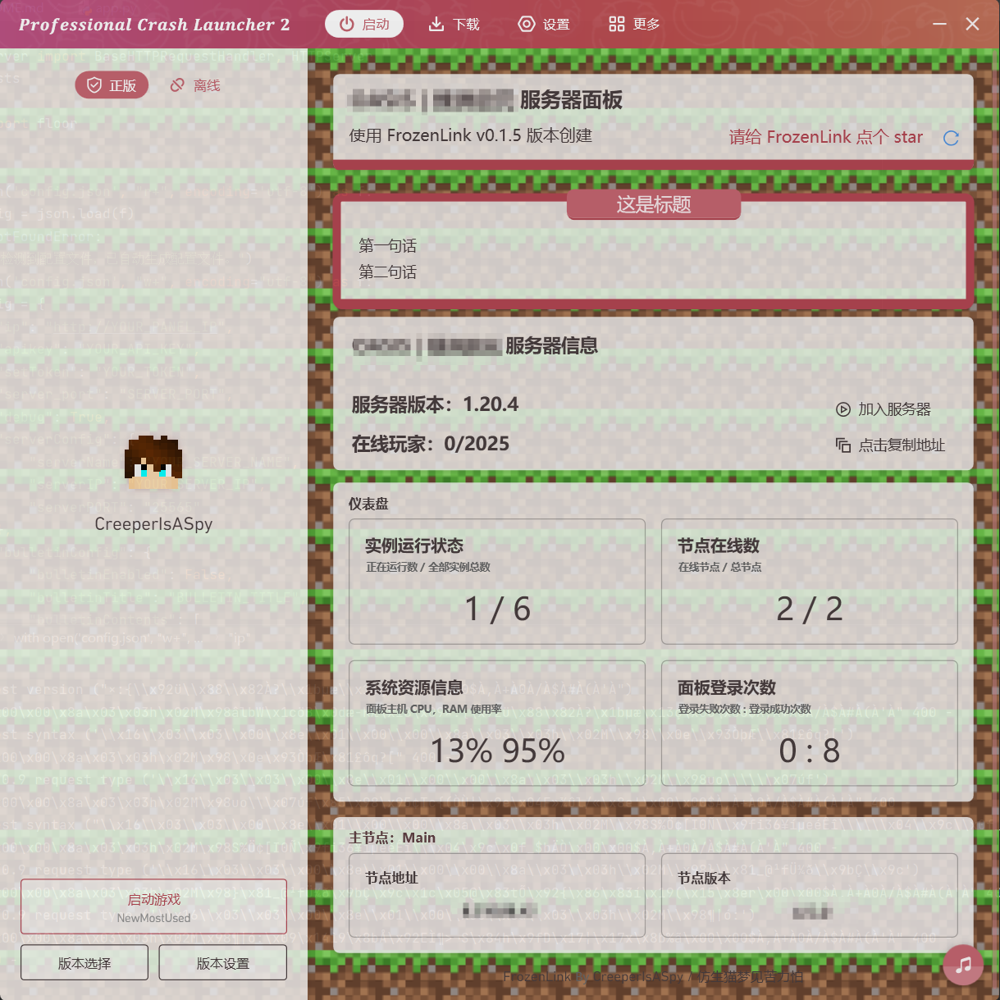

# FrozenLink 蓝冰链接 - 为你的服务器创建面板，不出启动器即可实时监测服务器状态
[](https://lbesson.mit-license.org/)
[](https://www.python.org/)  

: 967337278

***该项目为 PCL2 服务器监测面板，服务群体：服主以及服务器管理员。***  
***灵感源于 iceLink ，但其余全部为自己制作***  
***语言：Python  /  仓库地址：https://github.com/CreeperIsASpy/FrozenLink***
### 预览图



------

### 环境需求
+ python >= 3.7.2
+ requests ~= 2.32.3
+ urllib3 ~= 2.9.3

> [!IMPORTANT]  
> urllib3 版本一定不能是 3.x ！！！ 


### 部署
1. 下载 app.py 文件并 cd 到文件目录
2. 运行`python -m pip install requests`安装依赖
3. 运行`python app.py`生成默认配置文件
4. 打开 config.json 按要求更改以下配置 （***注意：下方未提起的配置项请不要随意修改***）  
（获取apikey的方法请见[文档](https://docs.mcsmanager.com/zh_cn/apis/get_apikey.html)）
  ```
{
    "ip": "<面板的 IP 地址（包含协议）>",
    "apikey": "<面板的 apiKey（参加上方说明）>",
    "debug": <调试模式开关（选填 true/false）>,
    "serverConfig": {
        "serverName": "<服务器名称>",
        "serverIP": "<服务器 IP 地址>",
        "serverPORT": "<服务器端口>"
    },
    "bulletinConfig": {        // 公告相关设置
        "bulletinEnabled": <公告开关（选填 true/false）>,
        "bulletinTitle": "这是公告标题",
        "bulletinContents": [
            "第一句话（这里支持分段，不分段也会自动换行的）",
            "第二句话（段落顺次排列下去）"
        ]
    }
}
  ```  
5. 运行  
`python app.py`


----
### 注意事项  
- 停止服务请按下 Ctrl + C 触发 `KeyboardInterrupt` 退出。
- 该项目的mc服务器状态API使用的是 ***https://api.mcsrvstat.us/*** 如果出现主页响应缓慢可能是 api 的问题。
- 快捷加入服务器启动的是当前选择的版本 ***（PCL2 无法通配指定版本，因此功能被取消了，但是服务器信息卡片上会显示服务器版本帮助你下载）***  
- 这个 repo 与原 iceLink 不同，***并没有管理端与客户端的区别*** ，因为 FrozenLink 的设计初衷是让 ***服务器的管理员*** 可以实时监测服务器状态，而不是普通玩家。

### 鸣谢
YuShanNan
https://github.com/YuShanNan/ChiLing-HomePage-PCL2  
Light-Beacon
https://github.com/Light-Beacon/PCL2-NewsHomepage  
icelly_QAQ
https://github.com/icelly-QAQ/PCL2-HomePage_iceLink


### 声明


该项目使用 [MIT 协议](https://lbesson.mit-license.org) 授权


项目灵感提供者以及`iceLink`冰点链接作者：[icelly_QAQ](https://github.com/icelly-QAQ)   
本项目作者：[CreeperIsASpy](https://github.com/CreeperIsASpy) / 仿生猫梦见苦力怕
